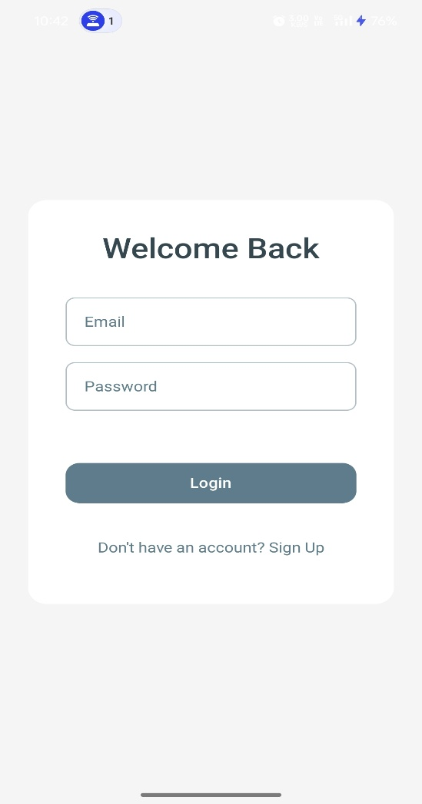
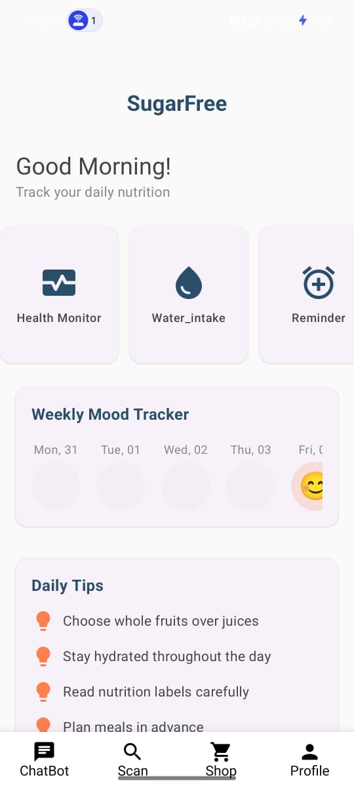
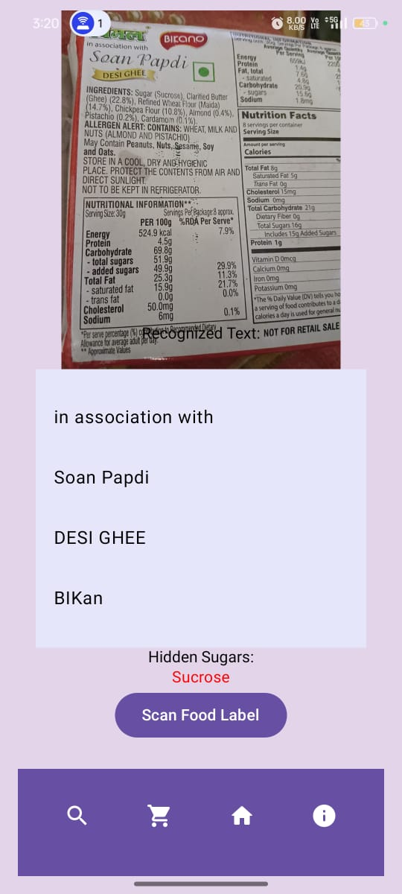
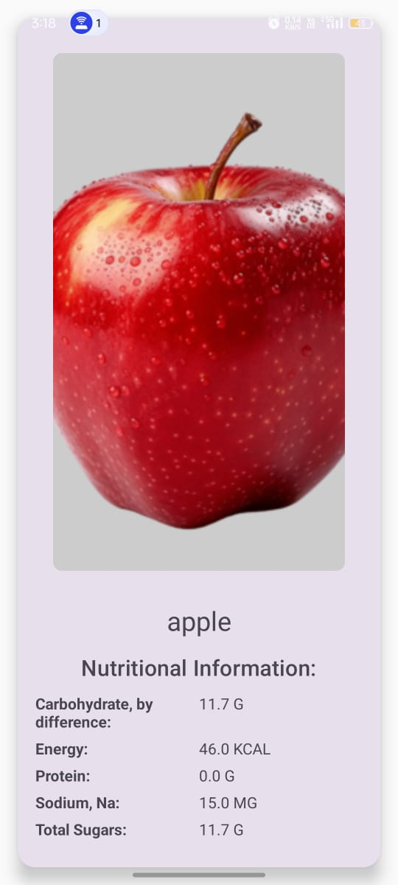
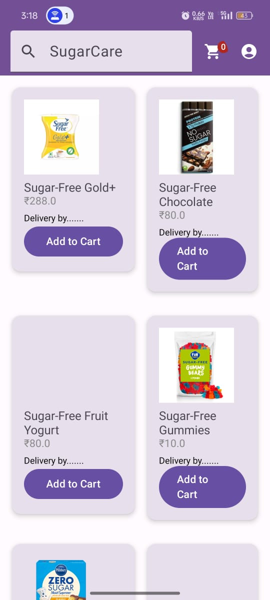
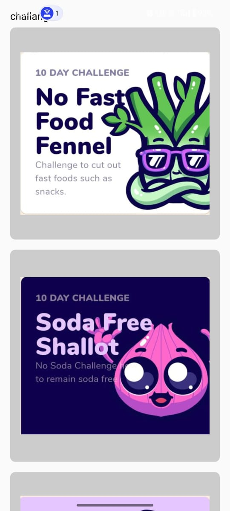

# 🍭 SugarCare: Personalized Health & Sugar Monitoring App


## 📱 Overview

**SugarCare** is an all-in-one mobile application built to assist individuals in managing their sugar intake and overall health. It combines powerful tools like OCR-based product label scanning, BMI/BMR calculators, personalized dashboards, and a curated sugar-free product marketplace — all in one seamless Kotlin-based Android app.

---

## ✨ Features

- 🔍 **Product Label Scanner**: Detect hidden sugars in food products using image recognition.
- 📊 **BMI & BMR Calculators**: Get personalized health insights.
- 🛍️ **Sugar-Free E-Commerce**: Browse and buy sugar-free alternatives.
- 🍉 **Fruit Nutrition Tracker**: Check sugar & nutrient values of fruits.
- 💧 **Water Intake Log**: Track daily hydration goals.
- ⏰ **Reminders**: Set alerts for hydration, medication, and more.
- 🕹 **Gamification**: Earn rewards and complete sugar-free challenges!
- 📈 **Progress Dashboard**: View your health trends with interactive graphs.

---

## 🛠 Tech Stack

| Technology | Purpose |
|------------|---------|
| **Kotlin** | Core Android development |
| **Jetpack Compose** | Modern declarative UI framework |
| **Firebase Auth** | Secure login & signup |
| **Firebase Firestore** | Real-time database |
| **TensorFlow Lite / Google Cloud Vision** | OCR for label scanning |
| **USDA API / Edamam** | Nutritional information source |
| **JUnit & Espresso** | Unit and UI Testing |

---

## 📸 Screenshots

| Feature | Preview |
|--------|---------|
| 🔐 Login/Signup |  |
| 🏠 Home & Health Monitor |  |
| 🧾 Label Scanner |  |
| 🍎 Fruit Nutrition Info |  |
| 🛒 Sugar-Free Store |  |
| 🎯 Challenges & Rewards |  |


---

## 📦 Project Structure

```
/sugarcare-app/
├── app/                 # Main application module
│   ├── auth/            # Authentication screens & logic
│   ├── scanner/         # OCR & image processing
│   ├── ecommerce/       # E-store integration
│   ├── health/          # BMI/BMR, water tracking
│   ├── fruitlist/       # Fruit database + UI
│   ├── gamification/    # Challenges & progress
├── firebase/            # Firestore rules and functions
└── README.md
```

---

## 🚀 Getting Started

### Prerequisites

- Android Studio (Arctic Fox or later)
- Firebase project with Firestore + Auth enabled
- USDA or Edamam API key
- Kotlin 1.6+

### Setup

```bash
git clone https://github.com/<your-username>/sugarcare-app.git
cd sugarcare-app
```

1. Open in Android Studio
2. Add your `google-services.json` file
3. Replace API keys in respective modules
4. Run on Android 7.0+ device or emulator

---


## 📚 Documentation

- [Jetpack Compose Docs](https://developer.android.com/jetpack/compose)
- [Firebase Firestore](https://firebase.google.com/docs/firestore)
- [Firebase Authentication](https://firebase.google.com/docs/auth)
- [Google Cloud Vision OCR](https://cloud.google.com/vision/docs/ocr)
- [USDA FoodData Central](https://fdc.nal.usda.gov/api-key-signup.html)

---


## 🤝 Contributors

- Harsh Kumar
- Harshit Shekhar
- Jatin Chhatri
- Makrand Tejas
- Prakash Bharti


